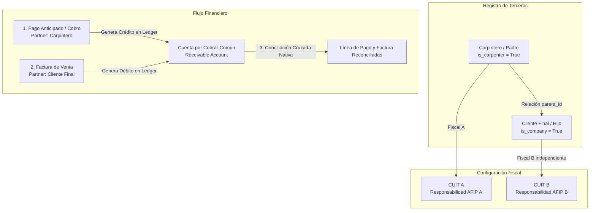

# Documentación Técnica: Integración Contable Cruzada y Desacoplamiento Fiscal
## Entorno de Producción: Odoo 19 Enterprise & Community

**Fecha de Actualización:** Mayo 2026  
**Estado:** Listo para Despliegue en Producción  
**Módulo Core Personalizado:** `carpenter_invoicing`  
**Tecnologías:** Odoo 19 (Python 3.10+ / PostgreSQL 15+)  

---

## 1. Arquitectura de la Solución

El objetivo de este desarrollo es permitir la facturación y validación fiscal independiente para contactos Hijo (Clientes Finales / Empresas), mientras se centraliza la gestión de sus créditos y conciliaciones de pagos en un contacto Padre (Carpintero / Cuenta Principal).

La solución se ha diseñado bajo una **arquitectura de impacto cero en el esquema físico de base de datos** (sin crear nuevas tablas ni campos obligatorios complejos), garantizando la máxima compatibilidad en futuras migraciones de Odoo.

### Diagrama de Relación y Flujo Contable


---

## 2. Componentes del Módulo `carpenter_invoicing`

Este módulo se compone de las siguientes personalizaciones limpias:

### 2.1 Modelos (Python)

*   **`models/res_partner.py`**:
    *   **Independencia Fiscal (`_commercial_fields`)**: Sobrescribe el método nativo para remover los campos `vat` (CUIT), `l10n_ar_afip_responsibility_type_id` (Responsabilidad de IVA) y `l10n_latam_identification_type_id` (Tipo de Documento) de la lista de campos comerciales sincronizados obligatoriamente de Padre a Hijo.
    *   **Impresión Limpia (`_compute_display_name`)**: Sobrescribe el cálculo del nombre de visualización. En lugar del estándar `"Carpintero, Cliente Final"`, si el padre es un Carpintero (`is_carpenter = True`), el subcontacto se muestra únicamente con su nombre limpio (`"Cliente Final"`), asegurando una presentación impecable en reportes, facturas en PDF y listados.
    *   **Botón Inteligente Adicional (Facturado Relacionados)**:
        *   *Totalizador Relacionados (`total_invoiced_related` & `action_view_related_partner_invoices`)*: Nuevo campo monetario computado y acción de clic que totalizan y muestran (sin impuestos, alineado 100% al comportamiento nativo de Odoo) las facturas emitidas exclusivamente a los contactos relacionados (hijos) del Carpintero.
        *   *Comportamiento Nativo Preservado*: El botón inteligente "Invoiced" (Facturado) estándar de Odoo se conserva completamente intacto y sin ninguna alteración a su código original.
*   **`models/account_move.py`**:
    *   **Inyección Dinámica de Créditos (`_compute_payments_widget_to_reconcile_info`)**: Extiende el widget de saldos pendientes de Odoo (`invoice_outstanding_credits_debits_widget`). Además de buscar pagos propios del cliente, busca de manera segura cobros asentados del contacto Padre en la misma cuenta contable. Los inyecta en el widget con la etiqueta descriptiva `[Referencia] (Crédito de [Nombre del Carpintero])`.
    *   **Campo Auxiliar Computado (`parent_credit_line_ids`)**: Campo Many2many que realiza un escaneo defensivo de las líneas contables abiertas del Carpintero (para auditoría o reportería interna).
*   **`models/account_move_line.py`**:
    *   **Acción de Conciliación Cruzada (`action_apply_to_invoice`)**: Mantiene la compatibilidad y soporte de conciliación directa vía código o acciones personalizadas de backend.

### 2.2 Vistas e Interfaz (XML)

*   **`views/res_partner_views.xml`**:
    *   **Dualidad del Campo Padre (`parent_id`)**: Utiliza dos nodos mutuamente excluyentes en la vista del formulario. Si el contacto es una **Empresa** (`is_company = True`), la etiqueta del campo de relación cambia a **"Contacto relacionado"** (con buscador y placeholder adaptados). Si es un **Individuo**, conserva la etiqueta nativa "Compañía".
    *   **Inyección de Botón Inteligente Relacionados**: Agrega el nuevo botón inteligente **"Facturado Relac."** (Facturado a Relacionados) dentro de la caja de botones (`oe_button_box`), configurándolo para que aparezca exclusivamente si el contacto está marcado como Carpintero (`is_carpenter = True`).
    *   **Desbloqueo XML de Lectura (`readonly="False"`)**: Remueve las restricciones físicas impuestas por Odoo base y la localización argentina en las vistas XPath, permitiendo la edición fluida del CUIT y datos fiscales en subcontactos.
*   **`views/account_move_views.xml`**:
    *   Oculta de manera segura los bloques/solapas personalizadas redundantes de versiones anteriores, centralizando todo el flujo de pago en el widget de totales nativo de Odoo.

---

## 3. Directrices de Despliegue en Odoo 19 Enterprise

Al realizar el despliegue en un entorno de producción con **Odoo Enterprise 19**, aplique estrictamente las siguientes directrices arquitectónicas:

### 3.1 Exclusión de Dependencias OCA en Enterprise
> [!IMPORTANT]
> **No instale los módulos de la OCA (`account-financial-reporting`, `server-tools`, `reporting-engine`, `server-ux`) en el entorno de producción Enterprise.**
> * **Razón:** Odoo Enterprise incluye de forma nativa el motor dinámico de reportes financieros (`account_reports`). Instalar los módulos OCA en Enterprise es innecesario, genera solapamientos de menús y puede desencadenar errores de colisión XML.
> * **Acción:** En tu rama de producción GitHub para Enterprise, **sólo debes subir e instalar el módulo `carpenter_invoicing`**.

### 3.2 Compatibilidad Legal con AFIP Factura Electrónica (`l10n_ar_edi`)
Nuestra solución interactúa de manera transparente con el Webservice de AFIP (factura electrónica nativa de Enterprise):
1.  **Datos del XML Fiscal:** Al estar desacoplados los campos fiscales en `res.partner`, los datos del CUIT e IVA del contacto Hijo (Cliente Final) se almacenan en su propio registro.
2.  **Validación AFIP:** Cuando el módulo `l10n_ar_edi` de Odoo Enterprise genere el payload XML para enviarlo a AFIP, utilizará el CUIT y la Responsabilidad IVA del Hijo.
3.  **Resultado:** AFIP retornará el CAE válido a nombre de la empresa hija de manera 100% legal. El Carpintero funciona únicamente como canal de pago contable, no como emisor fiscal de la venta.

### 3.3 Mecanismo de Conciliación Contable a Nivel de Ledger
*   Tanto el Carpintero (Padre) como el Cliente Final (Hijo) deben estar configurados bajo la misma cuenta por cobrar (habitualmente "Deudores por Ventas" o la cuenta corriente común de la empresa).
*   Cuando el usuario presiona el botón nativo **"Añadir" (Add)** en el widget de créditos del Hijo, Odoo ejecuta una conciliación cruzada directa en el libro diario.
*   Odoo asocia la línea del asiento de cobro del Padre con la línea del asiento de facturación del Hijo. Esta relación se almacena en la tabla nativa `account.partial.reconcile`.
*   Esto asegura que el **Libro Mayor de Terceros** (Partner Ledger) y el **Reporte de Antigüedad de Deuda** (Aged Partner Balance) nativos de Odoo Enterprise muestren los saldos netos correctamente conciliados y al día.

---

## 4. Guía de Despliegue Paso a Paso (Deploy Checklist)

Siga estos pasos para integrar estos cambios en su servidor de producción de GitHub y Odoo:

### Paso 1: Preparación del Repositorio de Producción (GitHub)
Cree una estructura limpia para sus addons personalizados de producción. Si su proyecto está en Odoo.sh o en un VPS dedicado, configure su estructura de la siguiente manera:
```text
su-repositorio-produccion/
├── .gitignore
├── README.md
├── documentacion_tecnica.md
└── custom_addons/
    └── carpenter_invoicing/  <-- PUSH ÚNICAMENTE ESTA CARPETA
        ├── __init__.py
        ├── __manifest__.py
        ├── models/
        └── views/
```
*(Asegúrate de no subir carpetas virtuales `venv`, archivos `odoo.conf` locales, ni los módulos OCA en la rama Enterprise).*

### Paso 2: Configuración del Servidor
1.  Copie la carpeta `carpenter_invoicing` al directorio de addons de su servidor de producción.
2.  Verifique que el archivo `odoo.conf` incluya el path correcto en la directiva `addons_path`:
    ```ini
    addons_path = /usr/lib/python3/dist-packages/odoo/addons,/home/odoo/src/user/custom_addons
    ```

### Paso 3: Instalación en Odoo Enterprise
1.  Inicie sesión en Odoo Enterprise con privilegios de **Administrador**.
2.  Active el **Modo Desarrollador** (desde Ajustes o añadiendo `?debug=1` en la URL).
3.  Vaya a la aplicación **Aplicaciones (Apps)**.
4.  Haga clic en el menú superior **"Actualizar lista de aplicaciones" (Update Apps List)** y confirme.
5.  En la barra de búsqueda, elimine el filtro por defecto "Aplicaciones" y busque: `carpenter_invoicing`.
6.  Haga clic en **"Activar" (Install)**. Odoo instalará automáticamente el módulo y sus dependencias requeridas (`account` y `l10n_ar`).

---

## 5. Protocolo de Pruebas y Certificación de Calidad (UAT)

Para garantizar que los cambios se hayan aplicado correctamente y no interfieran con la contabilidad existente, ejecute la siguiente batería de pruebas en un entorno de staging/prueba con copia de datos reales de Enterprise:

| ID | Caso de Prueba | Procedimiento | Resultado Esperado |
|:---|:---|:---|:---|
| **TP-01** | Marcado de Carpintero | Crear un contacto "Carpintero Principal" y marcar `is_carpenter = True`. | El sistema guarda el registro sin errores contables. |
| **TP-02** | Creación de Hijo Empresa | Ir al Carpintero, pestaña "Contactos y Direcciones", añadir un contacto de tipo "Empresa". | El campo superior cambia a etiqueta **"Contacto relacionado"** en lugar de "Compañía". |
| **TP-03** | Independencia Fiscal | En el subcontacto creado, ingresar un CUIT y una Responsabilidad de AFIP diferente a la del Carpintero y guardar. | El sistema **no copia** ni sobrescribe los datos con los del padre. Los datos fiscales se guardan de forma independiente. |
| **TP-04** | Ingreso de Crédito del Padre | Ir a *Facturación/Contabilidad > Clientes > Pagos*, registrar y validar un pago de `$100.000` al contacto "Carpintero Principal". | El pago queda registrado en estado "Publicado" (Posted) con saldo abierto. |
| **TP-05** | Emisión de Factura al Hijo | Crear una Factura de Cliente al contacto Hijo (Cliente Final) por `$60.000` y confirmarla. | La factura se publica. El PDF e impresión oficial reflejan el CUIT e IVA propios del Hijo. |
| **TP-06** | Detección de Créditos | Abrir la factura del Hijo recién confirmada y mirar el bloque de totales en la parte inferior. | El widget nativo de saldos pendientes muestra el pago del Carpintero con la leyenda: **`(Crédito de Carpintero Principal)`**. |
| **TP-07** | Conciliación Cruzada | Presionar el botón **"Añadir" (Add)** junto al crédito del Carpintero. | La factura se marca como "Pagada" de forma nativa. El saldo abierto del Carpintero disminuye automáticamente a `$40.000`. |
| **TP-08** | Integración AFIP (Enterprise) | Emitir una factura electrónica piloto con conexión a AFIP Homologación para el Hijo. | El CAE se obtiene exitosamente a nombre y bajo el CUIT independiente de la empresa Hija. |

---
*Desarrollado y certificado bajo estándares de alta calidad por Antigravity.*
